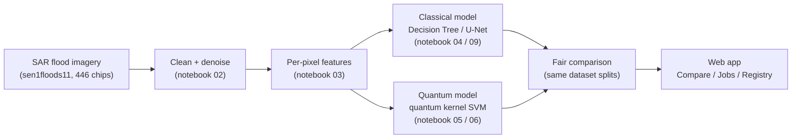

# SphoorthiQ — SAR Flood Segmentation, Classical + Quantum ML Platform

Cloud-agnostic ingestion, notebook-driven processing, a classical ML (Decision Tree + U-Net) + quantum ML
(real IBM Quantum) hybrid, a robustness sweep, per-stage observability, and a full web platform on top.

Built for Thales' **SAR Image Analysis** track - Quantum Innovation Summit 2026, Algorithm Design
Competition.

## Contents

- [How it works](#how-it-works) - the whole project, step by step
- [Status](#status) - what changed most recently
- [Quickstart](#quickstart) - run the notebooks
- [Web UI](#web-ui) - what the platform layer does, run it locally
- [Deploy](#deploy) - run it as a real, browser-reachable service (incl. Render)
- [Checks](#checks) - lint/test manually (no CI configured)

## How it works



1. **Get real flood-mapping data** - [sen1floods11](https://github.com/cloudtostreet/Sen1Floods11), 446
   real SAR satellite images of actual flood events, hand-labeled water / not-water. `notebooks/01_ingest.ipynb`.
2. **Clean it up** - raw radar imagery is noisy ("speckle"); filter it and put values on a consistent
   scale. `notebooks/02_process.ipynb`.
3. **Turn pixels into features** - reflectivity, ratio/difference, local texture, per pixel.
   `notebooks/03_feature_engineering.ipynb`.
4. **Train a classical model** - a **Decision Tree** classifies each pixel water / not-water (baseline);
   a U-Net does the same image-wise. `notebooks/04_classical_ml.ipynb` / `09_patch_unet.ipynb`.
5. **Train a quantum model** - a **quantum kernel SVM** does the same classification, with pixel
   similarity computed by a real quantum circuit (IBM Quantum hardware, or a local simulator).
   `notebooks/05_qml_ibm.ipynb` / `06_hybrid_ensemble_evaluation.ipynb`.
6. **Compare them fairly** - both trained/tested on samples from the *same* dataset splits (see
   [Status](#status)). The **Compare** tab shows both side by side, live.
7. **All of it behind a real web app** - log in, run any step, watch results roll in. See
   [Web UI](#web-ui).

Full architecture/dataflow diagram (every subsystem, not just the happy path): [docs/architecture.md](docs/architecture.md).

## Status

- **Classical baseline** is a **Decision Tree** (`class_weight="balanced"`, tuned via `GridSearchCV`) -
  not the Random Forest this project started with. Trains on **250 train / 50 valid / 40 test chips**
  (up from 20/8/44) - still a bounded subsample of the 252-chip train split, not all of it.
- **Quantum kernel SVM** now trains/tests on pixels pooled across *many* chips from those same splits,
  not one chosen chip - the earlier design's unfairness (a classical model seeing dozens of chips vs. a
  quantum model seeing one). Fixed by `sample_balanced_pixels_across_chips()`
  (`utils/fusion/pixel_features.py`), used by both notebooks and the live API. Confirmed working
  end-to-end, including on real IBM Quantum hardware (`ibm_marrakesh`), not just the simulator.
- **Compare page** only ever plots quantum runs tagged `is_benchmark=True` - i.e. ones that went through
  the multi-chip pooling above - so it can never show a stray single-chip result.

## Quickstart

```powershell
.\.venv\Scripts\pip install -r requirements.txt   # one file - everything, including qiskit for notebooks 05/06

.\.venv\Scripts\jupyter lab notebooks/
```

Run `notebooks/01_ingest.ipynb` through `09_patch_unet.ipynb` in order - see [Data](#data) for how the
446-chip dataset gets there.

- `05_qml_ibm.ipynb` / `06_hybrid_ensemble_evaluation.ipynb` default to `FORCE_SIMULATION = True` (local
  simulator, no real hardware, no queue, no cost). Set `False` + credentials (see
  [config/platform.yaml](config/platform.yaml)) to route through real IBM Quantum hardware.
- `08_robustness_sweep.ipynb` - 5 perturbation types x 5 flood events, systematic degradation matrix.

## Web UI

`apps/api/` (FastAPI) + `apps/web/` (React) turn the notebook pipeline into a real platform. Nothing here
is mocked: inference loads the same `.pkl`/`.pt` files the notebooks save, the Quantum tab submits real
circuits through the same `utils/qml/` code, the Jobs tab runs real `jupyter nbconvert --execute`.

| Tab / feature | What it does | Key files |
|---|---|---|
| **Auth** | Self-service signup/login (any username, no approval step) or "Log in with Auth0" - either way ends at the same session JWT. Forgot-password sends a real reset link (SMTP if configured, else returned directly). | `utils/auth/` |
| **Jobs** | Runs any notebook (`01`-`09`) as a real background subprocess - queued -> running -> success/failed with a log tail. Quantum runs log here too. | `utils/jobs/` |
| **Quantum** | Runs a real quantum-kernel SVM on a multi-chip sample. Pick **Qiskit Simulation** or **Real IBM Hardware** (paste a token for just that run, or set env vars once - see [Environment variables](#environment-variables)). Every IBM Cloud call is timeout-bounded so a slow/rate-limited account fails clearly instead of hanging. | `apps/api/routers/quantum.py`, `utils/qml/` |
| **Model registry** | Every successful `04`/`09` job auto-registers an immutable version (file + metrics). A "current" pointer decides what inference loads; "restore" needs no retraining. | `utils/registry/` |
| **Auto-retrain** | Diffs on-disk chips against a baseline; new chips trigger real retraining jobs. | `utils/pipeline/auto_retrain.py` |
| **Compare** | Registry-pointed Decision Tree/U-Net vs. the latest multi-chip quantum run, sim and real-hardware tracked as separate series (see [Status](#status)). Interactive chart + PNG download, live-polls every 5s. | `apps/api/routers/compare.py` |
| **Knowledge graph** | Built only from relationships the platform actually recorded - no fabricated edges. | `utils/graph/` |

### Run locally (dev)

Two processes, hot reload - separate terminals:

```powershell
.\.venv\Scripts\uvicorn apps.api.main:app --reload --port 8000

cd apps\web
npm install   # first time only
npm run dev
```

Open `http://localhost:5173`, sign up, then log in. Run `04_classical_ml` and `09_patch_unet` from the
Jobs tab first (or Jupyter) so the Inference tab has a model to load.

## Deploy

No containers, no separate frontend host - `apps/api/main.py` serves the built React UI itself, so the
whole platform is **one process on one port**. Nothing hardcodes `localhost`: API base URL, CORS origins,
and reset links are all derived from the actual incoming request - see [Environment variables](#environment-variables).

```powershell
cd apps\web
npm install
npm run build                 # writes apps/web/dist/ - main.py auto-detects and serves it

cd ..\..
.\.venv\Scripts\pip install -r requirements.txt
.\.venv\Scripts\uvicorn apps.api.main:app --host 0.0.0.0 --port 8000   # no --reload in production
```

Open `http://<the machine's address>:8000` - API and UI on the same origin, client-side routes resolve
correctly on a hard refresh.

### Render

[render.yaml](render.yaml) is a ready-to-use [Blueprint](https://render.com/docs/blueprint-spec) - connect
this repo in the Render dashboard ("New" -> "Blueprint"). Downloads a self-contained Node tarball to build
`apps/web/`, `pip install`s `requirements.txt`, starts `uvicorn` on Render's `$PORT`.

**Untested**: no Render account/credentials in this environment, so `render.yaml` hasn't been verified
against a real Render build.

### Data

The full dataset (`datasets/raw/`, ~1.7 GB) and trained models (`datasets/processed/`, ~269 MB) live in
this project's S3 bucket, **`s3://sphoorthq-geoverse/datasets/`**. Both dirs are `.gitignore`d - a fresh
clone has neither, and doesn't need them until a notebook or the API actually reads them:

- `datasets/raw/sen1floods11/` - `01_ingest.ipynb` pulls from S3 (see [AWS credentials](#aws-credentials)),
  falling back to the original public GCS bucket if unreachable.
- `datasets/processed/models/` - regenerate via `04_classical_ml` / `09_patch_unet`, or restore a version
  from the S3-backed registry (see [Persistence](#persistence)) - no retraining needed either way.

#### AWS credentials

Standard boto3 credential chain - env vars, `~/.aws/credentials`, or an IAM role, nothing hardcoded. Local
dev uses a named profile:

```ini
# ~/.aws/credentials
[sphoorthq-geoverse]
aws_access_key_id = ...
aws_secret_access_key = ...
```

Set `AWS_PROFILE=sphoorthq-geoverse` (or make it `[default]`) so notebooks and the API pick it up with no
extra config.

### Persistence

Render's free plan has no persistent disk - `users.db`, `.jwt_secret`, `datasets/reports/`, and
`datasets/processed/` would all be wiped on every deploy/restart. Two fixes:

- **S3-backed state** (`utils/core/cloud_state.py`) - set `STATE_S3_BUCKET`/`STATE_S3_PREFIX` and the
  model registry + job/run history read/write S3 instead of local disk. Doesn't cover `users.db`/
  `.jwt_secret` (a live SQLite file isn't safe on S3) - needs the option below, or a real DB, for accounts
  to survive redeploys too.
- **Render persistent disk** (paid plan) mounted at `datasets/` - covers everything, including the auth
  DB. `render.yaml` has that block ready, commented out.

### Environment variables

All optional - sensible dev defaults otherwise.

| Variable | Purpose | Default |
|---|---|---|
| `JWT_SECRET` | Signs session + reset tokens | auto-generated, persisted to `datasets/metadata/.jwt_secret` |
| `WEB_BASE_URL` | Base URL for password-reset links | derived from the incoming request |
| `SMTP_HOST` / `SMTP_USER` / `SMTP_PASSWORD` | Send real reset emails | unset - links written to `datasets/metadata/outbox/` instead |
| `AUTH0_DOMAIN` / `AUTH0_CLIENT_ID` / `AUTH0_CLIENT_SECRET` | Enables "Log in with Auth0" | unset -> that button 501s; self-service login still works |
| `CORS_ORIGINS` | Extra allowed origins, comma-separated | dev-server ports only |
| `IBM_QUANTUM_TOKEN` / `IBM_QUANTUM_INSTANCE` / `IBM_QUANTUM_CHANNEL` | Default account for "Real IBM Hardware" mode | unset - enter credentials per-request in the UI instead |
| `STATE_S3_BUCKET` / `STATE_S3_PREFIX` / `STATE_S3_REGION` | S3-backed registry + job/run history | unset -> local-disk-backed (wiped by a stateless redeploy) |

Full details on any of these: [config/platform.yaml](config/platform.yaml).

## Checks

No CI workflow is configured. Run these manually before pushing:

```powershell
.\.venv\Scripts\pytest tests/          # smoke tests - API wiring, metrics math, auth, registry, U-Net shape
.\.venv\Scripts\ruff check .           # lint (E/F/I - real bugs, not style opinions, see pyproject.toml)

cd apps\web
npm run lint                           # oxlint
npm run build                          # tsc -b && vite build
```
