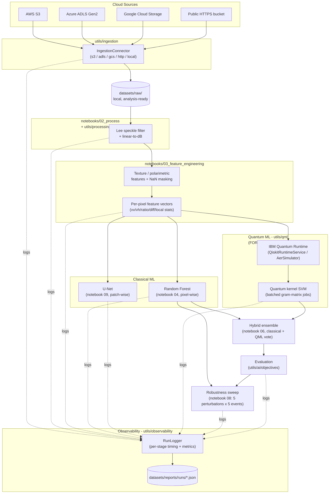

# geoverse platform architecture

A cloud-agnostic SAR flood-segmentation platform built for Thales' **SAR Image Analysis** track
(Quantum Innovation Summit 2026 - Algorithm Design Competition): "enhance segmentation accuracy and
computational efficiency in complex imaging environments" via a classical ML + quantum ML hybrid.

## Design

1. **Ingest** from any cloud (S3 / Azure Data Lake Storage Gen2 / Google Cloud Storage / a public HTTPS
   bucket / local disk) through one connector interface - `utils/ingestion/`.
2. **Process, engineer features, train, and evaluate in Jupyter notebooks** - `notebooks/01`-`09` - not a
   hidden service. Every stage is inspectable and re-runnable.
3. **ML + QML hybrid**: a classical Random Forest (pixel-wise, notebook `04`) and U-Net (patch-wise,
   notebook `09`) baseline (`utils/ai/classic/`) and a quantum kernel SVM that connects to real
   **IBM Quantum** (via `qiskit-ibm-runtime`'s `QiskitRuntimeService`) - `utils/qml/`. Results from both
   feed a hybrid ensemble (notebook `06`). Notebooks `05`/`06` default to `FORCE_SIMULATION = True`
   (local `AerSimulator`, no cloud calls) - flip that flag to route the same code through real hardware.
4. **Observability**: every notebook stage logs through `RunLogger` (`utils/observability/`) to
   `datasets/reports/runs/*.json` - timing, status, metrics, per stage, per run. Notebook `07` renders
   that history plus the architecture diagram below.
5. **Robustness**: notebook `08` sweeps 5 perturbation types (heavy speckle, incidence-angle shift,
   texture-channel dropout, two Gaussian noise levels) across 5 distinct flood events using
   `utils/ai/robustness/evaluate.py`'s `run_robustness_suite`.

## Architecture / dataflow diagram



(Source of truth for this diagram is `utils/observability/diagram.py: ARCHITECTURE_DIAGRAM` - notebook 07
prints the same string, so it can't drift out of sync silently.)

## utils/ layout

- **ingestion/** - `base.py` (interface), `s3_connector.py`, `adls_connector.py`, `gcs_connector.py`,
  `http_connector.py` (no-SDK public-bucket path - how `sen1floods11` was actually pulled),
  `local_connector.py`, `factory.py`.
- **catalog/** - `scanner.py` walks `datasets/raw/`, parses real manifests/metadata per source.
- **processing/** - `sar.py` (Lee speckle filter, linear-to-dB conversion).
- **fusion/** - `feature_engineering.py` (polarimetric ratio/difference, local texture stats),
  `pixel_features.py` (the shared 6-feature vector used by both classical and quantum models -
  `vv`, `vh`, `ratio`, `difference`, `vv_local_mean`, `vv_local_std`).
- **ai/**
  - `classic/` - `unet.py` (patch-based segmentation), `losses.py` (`MaskedComboLoss`: BCE+Dice, masked
    to valid pixels only), `sen1floods11_dataset.py` (real PyTorch `Dataset` over the downloaded chips -
    masks both the label's `-1` no-data convention and independent NaN/Inf pixels in the raw S1 GeoTIFFs).
  - `objectives/registry.py` - pluggable objective definitions + metrics (IoU, F1, boundary-F1, kappa).
  - `robustness/` - speckle/noise/dropout perturbations + an evaluation harness
    (`run_robustness_suite`, exercised by notebook `08`).
- **qml/** - `ibm_quantum.py` (real `QiskitRuntimeService` connection, local `AerSimulator` fallback),
  `hybrid_classifier.py` (`QuantumKernelSVM` wrapping it behind a stable interface).
- **observability/** - `run_logger.py` (`RunLogger`, structured per-stage JSON logs),
  `diagram.py` (this architecture diagram, as code).

## Platform layer (apps/api/, utils/auth/, utils/jobs/, utils/registry/, utils/graph/, utils/pipeline/)

Everything above is the ML pipeline; this is the real service wrapped around it, exposed by `apps/api/`
(FastAPI) and consumed by `apps/web/` (React). See the "Web UI" section of the top-level
[README.md](../README.md) for the full breakdown - in short: self-service auth (`utils/auth/`), a job engine
that runs notebooks as real subprocesses (`utils/jobs/`), a versioned model registry with restore
(`utils/registry/`), auto-retrain-on-new-data (`utils/pipeline/`), and a knowledge graph built only from
relationships the platform actually recorded (`utils/graph/`). No containers: for dev, `apps/api/` runs
directly via `uvicorn` and `apps/web/` via `npm run dev` as two processes; for a real deployment,
`npm run build` produces `apps/web/dist/`, and `apps/api/main.py` serves that itself, so it's one process
on one port (see README.md "Deploy"). No CI workflow is configured - lint (`ruff`/`oxlint`) and the smoke
test suite (`tests/`) are run manually (see README.md "Checks").

## Running

```powershell
.\.venv\Scripts\pip install -r requirements.txt   # one file - everything, including qiskit for notebooks 05/06

.\.venv\Scripts\jupyter lab notebooks/
```

Run `01` through `09` in order. `sen1floods11` (446 hand-labeled SAR flood chips, already downloaded to
`datasets/raw/sen1floods11/`) is the dataset every notebook actually operates on - see
`config/platform.yaml` for exactly which environment variables unlock real IBM Quantum hardware instead
of the local-simulator default.

- `08_robustness_sweep.ipynb` - systematic robustness evaluation (5 perturbations x 5 flood events).
- `09_patch_unet.ipynb` - trains the patch-based U-Net (`utils/ai/classic/unet.py`) with `MaskedComboLoss`.

## Honesty about scope

- The quantum kernel method is `O(n^2)` circuit evaluations - notebooks 05/06 deliberately use small
  subsamples (tens of points), not full-image pixel counts. That's a real, current limitation of quantum
  kernel methods on today's simulators/hardware queue times, not a shortcut taken for this repo.
- Notebooks 05/06 default to `FORCE_SIMULATION = True` - every QML result logged by this pipeline is
  explicitly tagged `is_real_hardware: False` (local `AerSimulator`) by default. The same code was
  verified earlier against real IBM Quantum hardware (`ibm_fez`, 156 qubits, real job submissions) with
  the batched `compute_gram_matrix` path - set `FORCE_SIMULATION = False` and supply credentials per
  `config/platform.yaml` to route through real hardware again; nothing else changes.
- `datasets/raw/sentinel1/`, `sentinel2/`, `dem/`, `worldcover/` (the four non-`sen1floods11` sources)
  do not spatially overlap - confirmed by parsing their footprints. They're not used by this pipeline for
  that reason; `sen1floods11`'s pre-aligned chips are the actual data source throughout.
- ~9% of `sen1floods11` chips have NaN/Inf pixels in the raw Sentinel-1 GeoTIFF itself, independent of and
  not always coincident with the label's own `-1` no-data convention (confirmed by direct inspection,
  e.g. `Pakistan_43105` has 733 NaN S1 pixels, none of which coincide with a `-1` label). All feature
  extraction, dataset loading, and robustness evaluation now mask on `(label != -1) & ~s1_nodata_mask`,
  not on the label alone - see `s1_nodata_mask()` in `utils/ai/classic/sen1floods11_dataset.py`.
